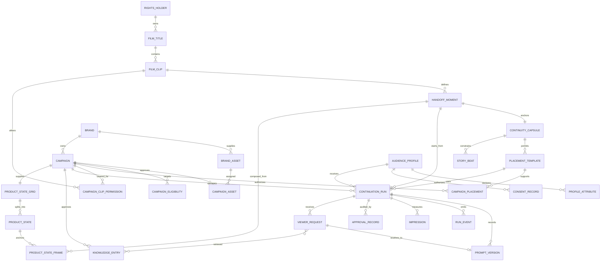

# Dynamic Product Placement Studio for Licensed Film Moments

## Summary

Build a studio-operator platform that lets rights holders ingest an approved
movie clip, identify a safe handoff moment, accept real sponsor assets, and
launch a sponsor-specific live continuation of the film that viewers can
steer through a knowledge-grounded director.

The hackathon demo plays a licensed clip to a designated handoff frame, then
uses that approved 16:9 final frame plus structured continuity information to
have Orbis continue the same moment in real time with a naturally embedded
sponsor. During the continuation a viewer can type requests ("show it in
blue", "open the lid"); a server-side director resolves each request against
the sponsor's approved knowledge base and product states before anything
reaches the model. It is a reusable platform for many films and brands, not a
bespoke scene generator.

## Product experience

### Studio operator workflow

1. Create a film title and register a licensed clip with runtime, aspect ratio,
   rights window, territory, and rights-holder metadata.
2. Select a handoff timestamp near a visual transition or moment of motion.
   Extract a 16:9 handoff frame.
3. Create a Continuity Capsule that records the location, characters,
   wardrobe, camera, lighting, visible objects, immediate story objective, and
   protected or disallowed changes.
4. Define allowed placement templates, such as storefronts, vehicles,
   packaging, drinks, posters, phone screens, or background signage.
5. Onboard a brand campaign with approved logo, product, packaging, and brief;
   map it to permitted clips, territories, audience segments, dates, and
   placement templates.
   Upload the product state grid and product knowledge (see Knowledge base
   below); approve the derived states, frames, and facts.
6. Select a consented demo profile. The server chooses the highest-priority
   eligible campaign, or an unbranded fallback when none qualify.
7. Generate a grounded opening prompt from the handoff frame, Continuity
   Capsule, selected campaign asset, and placement template. It is persisted
   as the first `PromptVersion` of the run.
8. Start the Orbis live continuation. Operators choose pre-approved story
   beats; viewers submit free-text requests that the director resolves to a
   beat, an approved product state, an overlay answer, or a refusal. Every
   prompt sent mid-run is generated server-side from approved records and
   persisted as a `PromptVersion` before it is sent.
9. Record approvals, prompt versions, model lifecycle events, placement
   checkpoints, and impressions in an audit trail.

### Hackathon demo

Use one approved cinematic clip with a clean exit shot and strong final 16:9
frame. The demo plays the original clip, switches among three consented profile
cards, explains the campaign choice, launches a live sponsor-integrated
continuation, applies one approved story beat, takes one viewer request that
morphs the sponsor product into another approved state, and displays the audit
trail.

## Technical design

- Extend the Next.js starter into Studio, Brand Portal, Playback Console, and
  Audit Ledger modules.
- Store structured data in PostgreSQL via Prisma and video/source assets in
  object storage.
- Use a media-processing worker to validate clips, generate contact sheets,
  extract the handoff frame, and pre-crop it to 16:9.
- Keep Reactor and Gemini keys server-side. Use the existing image upload,
  `set_image`, `set_prompt`, and `start` command path for every continuation.
- Generate every prompt server-side and persist it as a `PromptVersion`
  before sending. The browser sends beat IDs (operator) or viewer requests
  (viewer); it never sends prompt text. No campaign changes during a run.
- Viewer requests pass through the director pipeline (guardrail, classify,
  retrieve, resolve, compose, validate, queue) described under Viewer
  interaction layer.
- Select campaigns server-side using active rights, clip permission, territory,
  approved asset/template, audience-profile rules, frequency cap, priority,
  then deterministic ID tie-break.

## API boundaries

- `POST /api/titles`, `POST /api/clips`, and
  `POST /api/clips/:id/handoff-frame`
- `POST /api/continuity-capsules` and `POST /api/placement-templates`
- `POST /api/brands/:id/assets`, `POST /api/campaigns`, and
  `POST /api/campaigns/:id/approve`
- `GET /api/continuations/eligible?clipId&profileId`
- `POST /api/continuations` to lock an approved selection and create a run
- `POST /api/continuations/:id/prepare` to produce the grounded prompt
- `POST /api/continuations/:id/start` to start the Orbis session
- `POST /api/continuations/:id/steer` to submit a predefined story beat
- `POST /api/continuations/:id/requests` to submit a viewer request; returns
  the resolved outcome and, if a prompt was sent, its `PromptVersion` id
- `POST /api/continuations/:id/events` to record playback and model events
- `POST /api/campaigns/:id/grid`, `POST /api/campaigns/:id/knowledge`, and
  `POST /api/campaigns/:id/states/:stateId/qa` for the knowledge base

## Data model

Core entities: `RightsHolder`, `FilmTitle`, `FilmClip`, `HandoffMoment`,
`ContinuityCapsule`, `PlacementTemplate`, `StoryBeat`, `Brand`, `BrandAsset`,
`Campaign`, `AudienceProfile`, `ContinuationRun`, `PromptVersion`, `RunEvent`,
`Impression`, `ApprovalRecord`, `KnowledgeEntry`, `ProductStateGrid`,
`ProductState`, `ProductStateFrame`, and `ViewerRequest`.

## Viewer interaction layer

### Principle

A viewer request never reaches Orbis as text. The director resolves it into
one of four outcomes:

| Outcome | What is sent to Orbis | Record |
|---|---|---|
| An approved story beat matches | that beat's stored prompt | `StoryBeat`, `PromptVersion` |
| An approved product state is reachable by morph | a generated one-change prompt, validated, then stored | `ProductState`, `PromptVersion` |
| A product state needs a new anchor | `reset` → `set_image(state frame)` → `set_prompt` → `start` | `ProductStateFrame`, `RunEvent` |
| A fact question, out of scope, or blocked | nothing; UI overlay or refusal | `ViewerRequest` |

Invariant: no text that was not generated server-side from approved records
reaches Orbis, and every prompt sent is persisted as a `PromptVersion` before
it is sent.

### Knowledge base

Scoped per `Campaign`. Retrieval is filtered by `campaignId` in the query
layer, never by prompt text.

- `KnowledgeEntry`: one approved fact each, with source and status
  (`draft` / `approved`). Includes allowed and forbidden claims written as
  positive statements. Only `approved` entries are embedded.
- `ProductStateGrid`: the advertiser's uploaded grid image with the layout
  declared at upload (rows × cols, cell → state id). Kept as the record of
  what was supplied; never sent to Orbis.
- `ProductState` (one per grid cell): cropped tile, label, approved visual
  description, a one-action change phrase for reaching it, and
  `reachability`: `morph` (a prompt gets there mid-run), `anchor` (needs a
  restart from a composed frame), or `unsupported`. Set by QA, not by the
  advertiser.
- `ProductStateFrame`: a 16:9 frame composed from the handoff frame plus one
  tile, used only for `anchor` states. Composed at ingest, approved with the
  campaign.
- Embeddings over approved `KnowledgeEntry` and `ProductState` descriptions.

### Ingest additions (Brand Portal)

1. Upload grid, declare layout, add product details. Reject grids whose cell
   resolution is below the floor.
2. Split into tiles. A vision model drafts a description and change phrase per
   tile.
3. For each `HandoffMoment × ProductState`, compose a candidate
   `ProductStateFrame` with Nano Banana 2 (`gemini-3.1-flash-image`, 16:9,
   at most 10 reference inputs).
4. Advertiser approves facts, descriptions, and frames. Nothing unapproved is
   embedded.
5. QA session: script every state from the handoff frame and record which
   morph reliably. That sets `reachability`.

All expensive work happens at ingest so the live path stays fast.

### Runtime flow (per viewer request)

1. Guardrail: moderation, injection check, competitor and off-brief filter.
   Fail → refusal, logged.
2. Classify: beat request, state request, fact question, scene/camera change,
   or out of scope.
3. Retrieve: direct state or beat requests are a lookup against the session
   cache (no RAG). Ambiguous or multi-part requests go to bounded agentic RAG:
   tools scoped to the campaign, a maximum number of tool calls, a hard
   timeout, and a fallback to nearest-neighbour embedding search on timeout.
4. Resolve: beat → its prompt. `morph` state → compose. `anchor` state →
   re-anchor only if the campaign allows continuity breaks, otherwise offer
   the nearest `morph` state. Unknown → refuse or overlay. The Continuity
   Capsule's protected changes always win over the request.
5. Compose: one visible change, present tense, no negation, no vague intent
   words, within the prompt guide's limits. The viewer's words are never
   copied through.
6. Validate: length, forbidden claims, other brand names, capsule
   protections. Fail → back to resolve with the next-best outcome.
7. Persist the `PromptVersion`, then send through the steer queue
   (latest-wins, minimum interval about 3 s, tuned from QA).
8. Confirm via `chunk_complete.active_prompt` and write a `RunEvent`.

Fact answers (price, specs) go to a UI overlay from `KnowledgeEntry`;
generated video does not render text reliably.

### Model constraints this is built around

- `set_image` is read only at `start`; a mid-run change has no effect until
  `reset` and a new `start`. Grid states cannot be swapped in live; they are
  either text-reachable or a re-anchor.
- A re-anchor is a visible discontinuity (`reset`, then a first chunk with 0
  frames). It breaks the "same moment continues" promise, so it is opt-in per
  campaign and a fallback, never the default.
- Non-16:9 images are stretched. Raw grids and raw tiles are never sent.
- A prompt lands 2–4 s after send. Director latency adds to that; target P95
  ≤ 1.5 s from viewer submit to prompt sent.
- Follow-up prompts describe only the change (prompt guide). Whether the
  sponsor product must be restated to stay stable is an open test.
- One viewer is one Orbis session (about $0.58 per engaged minute at
  $0.0097/s; 5 concurrent sessions per account by default). Interactive ads
  need a commercial agreement with Reactor before scale.

## Verification

- Validate ingestion, handoff-frame extraction, and 16:9 pre-cropping.
- Reject runs without approved rights, campaign/template permission, asset, or
  audit approval.
- Test selection rules for expiry, territory, campaign cap, missing asset,
  disallowed clip, and unbranded fallback.
- Reject prompt text from the client, sponsor changes during a run, unapproved
  beats, and any prompt not backed by a server-created `PromptVersion`.
- Injection test set: viewer text and knowledge-entry text that try to change
  the sponsor, drop capsule protections, or name a competitor.
- Cross-campaign leak test: retrieval in campaign A's session never returns
  campaign B's entries.
- Reachability matrix per product category (colour, open/closed, accessory,
  material) from the QA session, with morph success rate.
- Latency: viewer submit → prompt sent, and submit → `active_prompt`
  confirmed.
- Verify Orbis image acceptance, ready state, start, chunk events, steering,
  errors, reset, and disconnect behavior.
- Rehearse: original clip, selected handoff, live continuation, one story beat,
  one viewer request, and complete audit trail.

## Assumptions

- Rights holders supply approved clips and all commercial permissions.
- The first demo contains one approved clip, three real-brand campaigns, three
  consented simulated profiles, a small approved template/beat set, and one
  product grid with a handful of `morph` states.
- Viewer free-text is a new data channel; the consent record must cover what
  is logged per profile.
- The platform is clip-to-live continuation, not frame-accurate modification
  of an already encoded source clip. A future inpainting/compositing provider
  can use the same handoff, continuity, and placement records.
